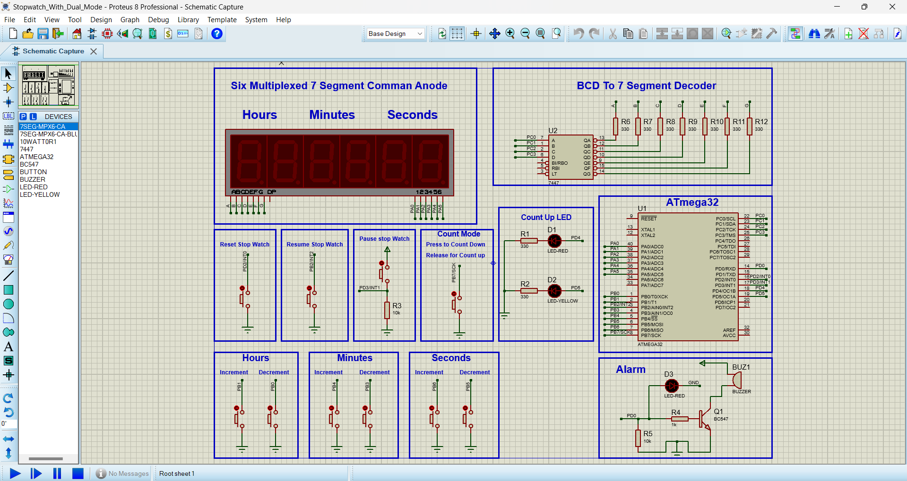
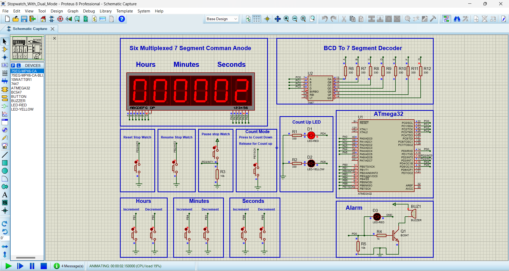

# Dual-Mode Stopwatch with ATmega32
A versatile digital stopwatch with increment and countdown modes featuring six multiplexed seven-segment displays, precise timing control, and intuitive button interface.

## Key Features

- **Dual Operation Modes**  
  - Increment Mode: Counts up from 00:00:00
  - Countdown Mode: Timer with user-defined start time
- **Precise Time Control**  
  Hours/Minutes/Seconds adjustment buttons
- **Intuitive Controls**  
  Reset, Pause, Resume functions with LED mode indicators
- **Audible Alerts**  
  Buzzer activation at countdown completion
- **Real-time Display**  
  Six multiplexed seven-segment displays

## Hardware Components

| Component               | Connection              |
|-------------------------|-------------------------|
| Microcontroller         | ATmega32                |
| Seven-Segment Displays  | 6x Common Anode (7447 decoder + PORTC) |
| Reset Button            | PD2 (INT0)              |
| Pause Button            | PD3 (INT1)              |
| Resume Button           | PB2 (INT2)              |
| Mode Toggle Button      | PB7                     |
| Time Adjustment Buttons | PB0-PB1, PB3-PB4, PB5-PB6 |
| Buzzer                  | PD0                     |
| Mode LEDs               | PD4 (Red), PD5 (Yellow) |

## Operation Modes

### Increment Mode (Default)
- Starts counting up from 00:00:00 on power-up
- Red LED (PD4) illuminated
- Controls:
  - Reset: Reset to 00:00:00
  - Pause/Resume: Freeze/continue counting

### Countdown Mode
- Activated by mode toggle button (PB7)
- Yellow LED (PD5) illuminated
- Set start time using adjustment buttons
- Buzzer activates at 00:00:00
- Controls:
  - Set hours/minutes/seconds
  - Start countdown with Resume button

## Code Structure

```
Interface1_Project/
├── main.c                  # Core application logic
├── timer.[c/h]             # Timer1 CTC mode configuration
├── interrupts.[c/h]        # External interrupt handlers
├── seven_segment.[c/h]     # Display driver for multiplexed segments
├── buttons.[c/h]           # Button input handling
└── buzzer.[c/h]            # Alarm control
```

## Pin Configuration

| Function            | Port/Pin   | Description                  |
|---------------------|------------|------------------------------|
| Segment Data        | PORTC0-3   | BCD input to 7447 decoder    |
| Display Enable      | PORTA0-5   | 6 display enable lines       |
| Reset               | PD2 (INT0) | External interrupt (falling) |
| Pause               | PD3 (INT1) | External interrupt (rising)  |
| Resume              | PB2 (INT2) | External interrupt (falling) |
| Mode Toggle         | PB7        | Digital input                |
| Hours Adjustment    | PB0-PB1    | Increment/Decrement          |
| Minutes Adjustment  | PB3-PB4    | Increment/Decrement          |
| Seconds Adjustment  | PB5-PB6    | Increment/Decrement          |
| Buzzer              | PD0        | Audio output                 |
| Mode LEDs           | PD4-PD5    | Increment/Countdown indicators |

## Getting Started

1. **Open Proteus Simulation**:
   - Launch `home_automation_system.pdsprj`

2. **Build and Program**:
   ```bash
   cd Interface1_Project
   make all
   # Program ATmega32 with generated .hex file
   ```

3. **Operation**:
   - Power on: Starts in increment mode
   - Press PB7 to toggle to countdown mode
   - Use adjustment buttons to set time
   - Control with Reset/Pause/Resume buttons

## Customization
Modify timing parameters in `timer.h`:
```c
#define F_CPU 16000000UL       // System clock frequency
#define PRESCALER 256          // Timer1 prescaler
#define COMPARE_VALUE 62499    // 1Hz interrupt (1s interval)
```

## Circuit Diagram



## License
This project is open-source under the MIT License. Feel free to modify and share.

---
## Author
*Ahmed Alaa*  
*Contact: ahmedgafer06@gmail.com*